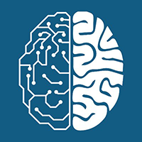

# Artificial Cognitive Systems

Understanding how mind emerges from matter is one of the great remaining questions in science. The Artificial Cognitive Systems lab, headed by [Marcel van Gerven](https://www.ru.nl/personen/gerven-m-van/), studies the computational principles that underlie natural intelligence and uses these principles to develop more capable and efficient intelligent technology. You can check out our publications [here](https://scholar.google.nl/citations?user=sX0ZypwAAAAJ&hl=nl).
 
## News

<a class="twitter-timeline" href="https://twitter.com/artcogsys?ref_src=twsrc%5Etfw">Tweets by artcogsys</a> 
